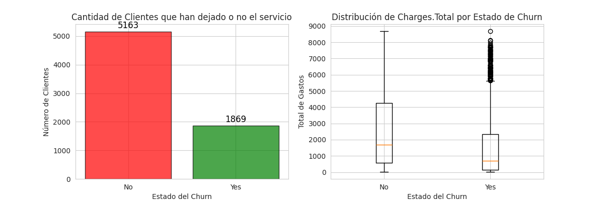
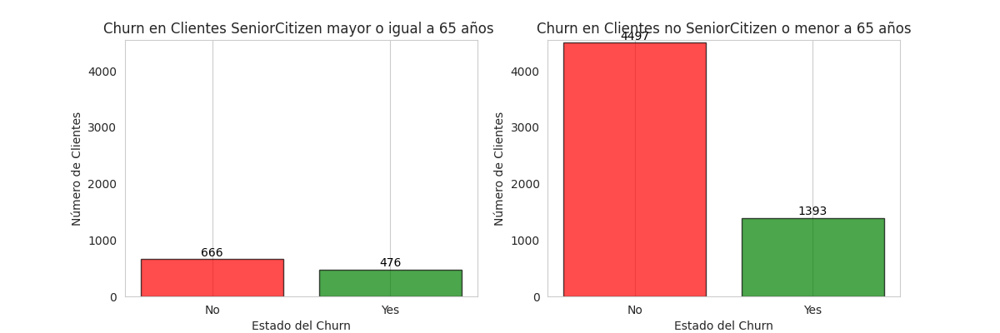
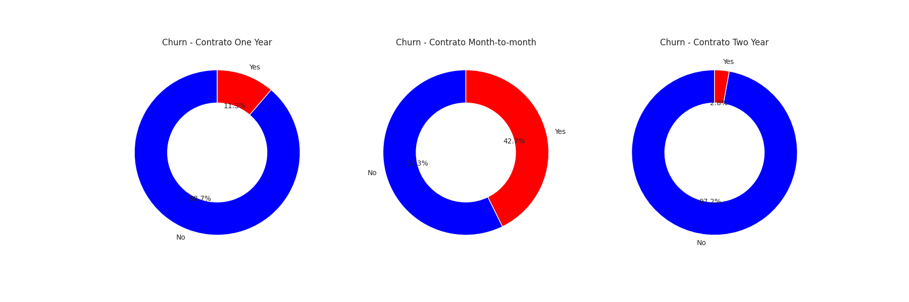
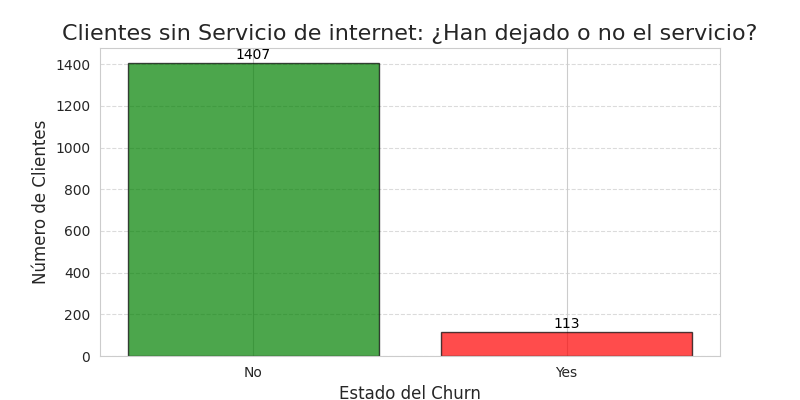
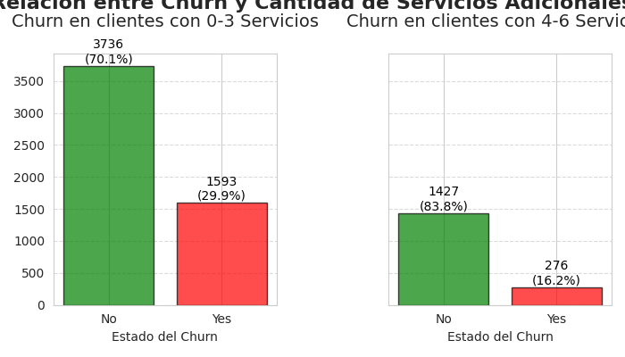
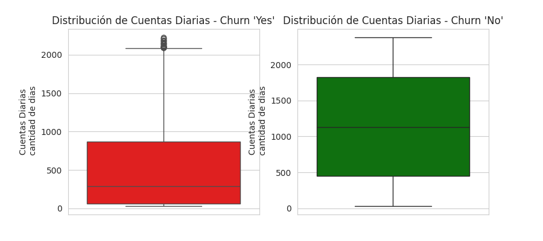

# Análisis de Churn

## Hallazgos Clave

A continuación, se presentan los hallazgos más relevantes, respaldados por los gráficos generados durante el análisis:

### 1.1 Visión General del Abandono (Churn)
- **Desbalance de Clases:** Se observa un claro desbalance en la variable Churn, con una cantidad significativamente mayor de clientes que No abandonan.
- **Tasa de Abandono General:** Aproximadamente el 26.6% de los clientes han abandonado el servicio. Esta cifra subraya la importancia de implementar estrategias de retención.

### 1.2 Influencia de los Gastos Totales (Charges.Total)
- Los clientes que sí abandonan el servicio tienden a tener gastos totales (**Charges.Total**) significativamente más bajos en comparación con aquellos que permanecen. Esto sugiere que el abandono a menudo ocurre en las etapas tempranas de la relación con el cliente.
- **Outliers en Yes Churn:** Se destaca la presencia de un grupo considerable de clientes que abandonaron a pesar de tener **Charges.Total** muy elevados. Estos casos atípicos podrían representar clientes antiguos o de alto valor, requiriendo una investigación más profunda.

### 1.3 Impacto de la Edad (SeniorCitizen)
- Los clientes clasificados como **SeniorCitizen** (mayor o igual a 65 años) muestran una tasa de abandono considerablemente más alta (**aprox. 41.7%**) en comparación con los clientes más jóvenes (**aprox. 23.7%**).

### 1.4 Relevancia del Tipo de Contrato (Contract)
- **El tipo de contrato es uno de los predictores más fuertes del abandono:**
  - **Contratos Mes a Mes (Month-to-month):** Tasa de abandono más alta (**aprox. 42.7%**), debido a la falta de compromiso a largo plazo.
  - **Contratos de Un Año (One Year):** Tasa de abandono moderada (**aprox. 11.3%**).
  - **Contratos de Dos Años (Two Year):** Tasa de abandono extremadamente baja (**aprox. 2.8%**), indicando la mayor lealtad.

### 1.5 Importancia del Servicio de Internet
- Los clientes que no tienen servicio de internet exhiben una tasa de abandono notablemente baja (**aprox. 7.4%**), lo que sugiere estabilidad y lealtad dentro de este segmento.

### 1.6 Cantidad de Servicios Adicionales
- Existe una relación inversa entre la cantidad de servicios adicionales contratados y la tasa de abandono:
  - **Clientes con 0-3 servicios adicionales:** Tasa de abandono más alta (**aprox. 29.9%**).
  - **Clientes con 4-6 servicios adicionales:** Tasa de abandono significativamente menor (**aprox. 16.2%**).

### 1.7 Cantidad de cuentas diarias
Conclusión General del Gráfico Cuentas_Diarias:
El gráfico de Cuentas_Diarias por Churn refuerza la idea de que la antigüedad del cliente es un predictor crítico del abandono.

- Clientes "nuevos" (baja antigüedad/bajas Cuentas_Diarias) tienen un riesgo de churn mucho mayor.
- Clientes "antiguos" (alta antigüedad/altas Cuentas_Diarias) son significativamente más leales.

## 2. Sugerencias para la Retención de Clientes

### Fomentar Contratos a Largo Plazo
- Implementar incentivos atractivos (descuentos, promociones, beneficios exclusivos) para migrar clientes de contratos mes a mes a planes más largos.
- Destacar la estabilidad y beneficios de los contratos de uno o dos años.

### Estrategias Específicas para Senior Citizens
- Desarrollar planes adaptados a clientes mayores, incluyendo interfaces más simples y atención personalizada.
- Ofrecer paquetes con beneficios relevantes para este grupo demográfico.

### Aumentar la "Adherencia" del Cliente
- Promover servicios adicionales mediante bundles atractivos o pruebas gratuitas.
- Incentivar la contratación de servicios como seguridad online, streaming y soporte técnico.

### Enfocarse en la Experiencia Temprana del Cliente
- Optimizar el proceso de **onboarding** para mejorar la retención de clientes nuevos.
- Asegurar instalación fluida, soporte proactivo y comunicación efectiva desde el inicio del servicio.

### Investigar Abandonos de Clientes de Alto Valor
- Realizar un análisis cualitativo de clientes con **Charges.Total** altos que abandonaron el servicio.
- Identificar problemas subyacentes como fallos en el servicio, problemas de facturación o competencia.

### Reconocer la Lealtad de Clientes sin Internet
- Aunque presentan baja tasa de abandono, explorar oportunidades para ofrecerles servicios adicionales adaptados a sus necesidades.

## 3. Próximos Pasos
Este análisis proporciona una base sólida, pero se pueden considerar estudios adicionales, como:

- **Modelado Predictivo:** Implementación de **Machine Learning** (Regresión Logística, Árboles de Decisión, Random Forest) para predecir el churn.
- **Ingeniería de Características:** Creación de nuevas variables (ej. ratio de **Charges.Monthly** por tenure).
- **Análisis de Segmentos Específicos:** Profundización en subgrupos de clientes (ej. **SeniorCitizen con Fiber Optic**).
