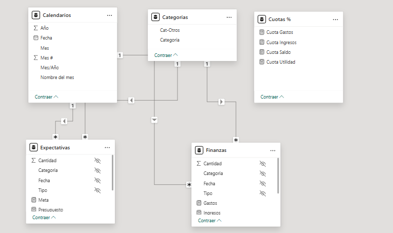
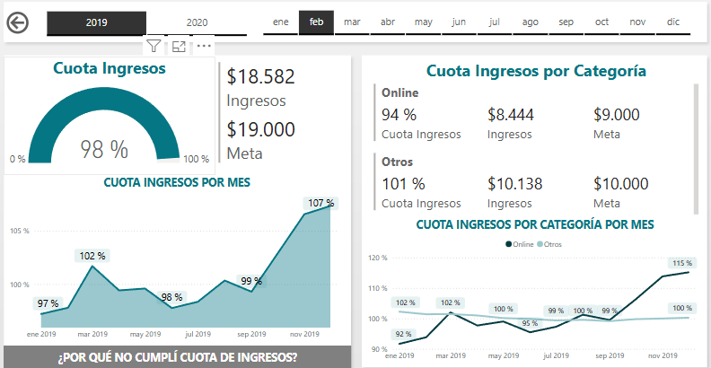
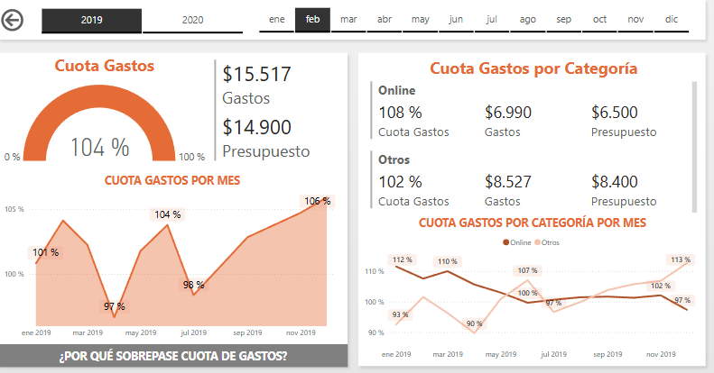
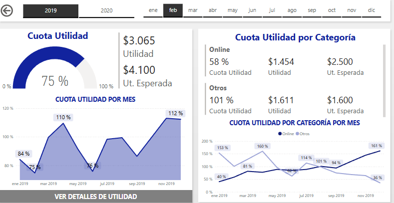
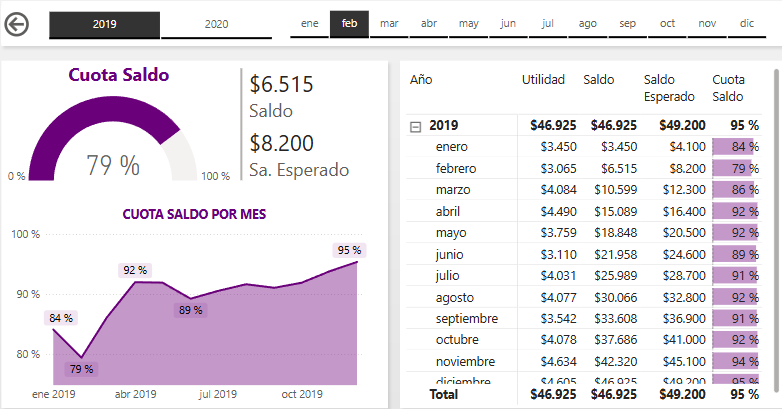

# Dashboard Financiero

Este README proporciona una guía paso a paso para la creación de un dashboard financiero en Power BI.

## Estructura del Dashboard

## Modelo de Datos

El modelo de datos del dashboard financiero se compone de varias tablas interrelacionadas:

- **Categorías**:
  - Contiene los diferentes tipos de gastos e ingresos.
  - Relacionada con la tabla Expectativas por la columna `Categoría`.

- **Expectativas**:
  - Contiene las metas financieras para cada categoría.
  - Relacionada con la tabla Categorías por la columna `Categoría`.

- **Calendarios**:
  - Contiene las fechas para el seguimiento temporal de los registros financieros.
  - Relacionada con la tabla Finanzas por la columna `Fecha`.

- **Finanzas**:
  - Contiene los registros detallados de transacciones financieras.
  - Relacionada con la tabla Categorías por la columna `Categoría`.

### 1. Cuota de Ingresos

- **Descripción**: Muestra la comparación entre los ingresos actuales y la meta de ingresos.
- **Elementos**:
  - Medidor de porcentaje de cuota de ingresos.
  - Gráfico de líneas de la cuota de ingresos por mes.

### 2. Cuota de Gastos

- **Descripción**: Presenta los gastos actuales comparados con el presupuesto asignado.
- **Elementos**:
  - Medidor de porcentaje de cuota de gastos.
  - Gráfico de líneas de la cuota de gastos por mes.
  - Comparación de la cuota de gastos por categoría.

### 3. Cuota de Utilidad

- **Descripción**: Indica la diferencia entre los ingresos y los gastos, mostrando la utilidad obtenida.
- **Elementos**:
  - Medidor de porcentaje de cuota de utilidad.
  - Gráfico de líneas de la cuota de utilidad por mes.
  - Comparación de la cuota de utilidad por categoría.

### 4. Cuota de Saldo

- **Descripción**: Muestra el saldo disponible comparado con el saldo esperado.
- **Elementos**:
  - Medidor de porcentaje de cuota de saldo.
  - Gráfico de líneas de la cuota de saldo por mes.
  - Tabla con detalles mensuales de utilidad, saldo y saldo esperado.

## Pasos para Crear el Dashboard

1. **Preparación de Datos**
   - Importar los datos necesarios desde [la fuente](data).
   - Limpiar y transformar los datos para adecuarlos al análisis.

2. **Modelado de Datos**
   - Crear relaciones entre las diferentes tablas.
   - Definir las medidas y columnas calculadas necesarias [Medidas](measures).

3. **Diseño del Dashboard**
   - Añadir visualizaciones clave (medidores, gráficos de líneas, tablas).
   - Configurar los elementos visuales para que se actualicen dinámicamente con los datos.

4. **Añadir Interactividad**
   - Configurar filtros y segmentadores para permitir análisis detallados.
   - Añadir botones de navegación y otras características interactivas.

5. **Publicación y Compartición**
   - Publicar el dashboard en el servicio de Power BI.

## Requisitos

- Microsoft Power BI Desktop
- Fuentes de datos (CSV, Excel,)

