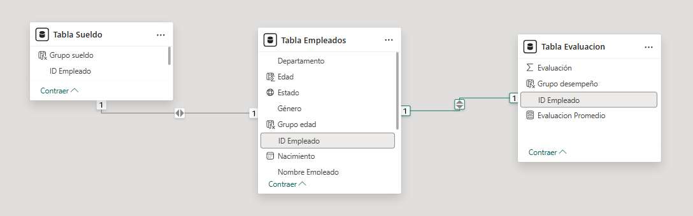
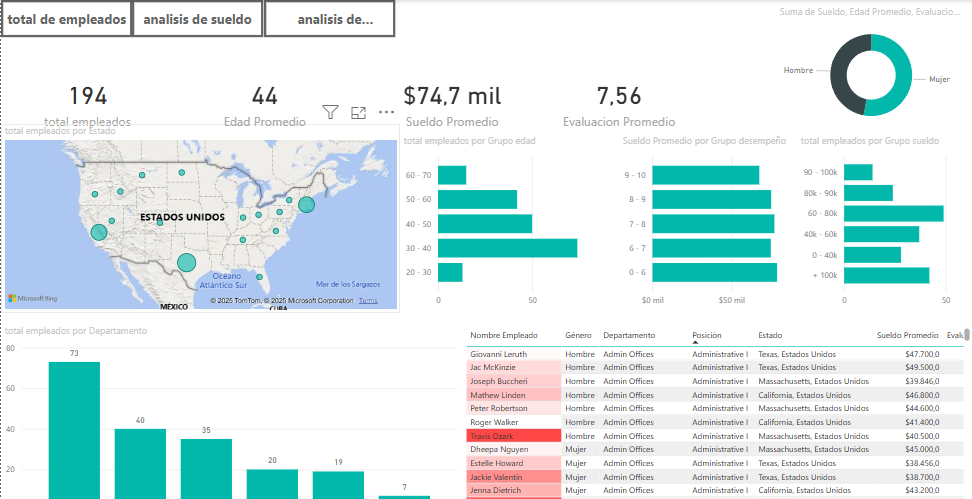
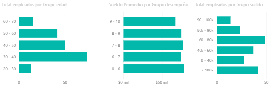
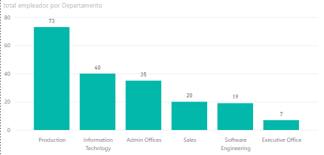
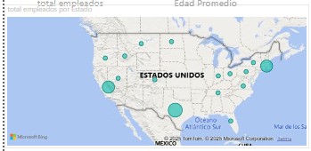

# Proyecto de Dashboard de Recursos Humanos

Este proyecto tiene como objetivo desarrollar un **dashboard** interactivo y fácil de usar para la gestión de recursos humanos. El **dashboard** proporcionará una vista comprensiva de los datos de empleados, evaluaciones y sueldos, permitiendo a los administradores tomar decisiones informadas y mejorar la gestión del personal.

## Estructura del Proyecto

El proyecto está organizado de la siguiente manera:

- **data/**: Contiene los archivos CSV con los datos necesarios para el **dashboard**.
  - `Tabla Empleados.csv`: Información de los empleados, incluyendo sus identificadores únicos (ID Empleado).
  - `Tabla Evaluacion.csv`: Evaluaciones de desempeño de los empleados.
  - `Tabla Sueldo.csv`: Información sobre los sueldos de los empleados.
- **imgs/**: Contiene las imágenes utilizadas en el **dashboard**.
  - `relacion_de_tablas.png`: Diagrama de la relación entre las tablas.

## Relación de las Tablas

Las tablas están relacionadas mediante el campo `ID Empleado`, que actúa como clave primaria en la `Tabla Empleados` y clave foránea en las tablas de `Evaluación` y `Sueldo`.

## Visualización de hoja de total de empleados

Para esta hoja tendremos indicadores, Tarjetas, Gráficos de barras apiladas, Mapa, Gráfico de columnas apiladas y tablas que muestren los diferentes datos de nuestros empleados.

## Estructura de gráfico de barras apiladas

En el gráfico de la izquierda se analizan los grupos de edad con el total de empleados utilizando la medida DAX de `Grupo_Edad.dax`. En el gráfico del centro, se analiza el sueldo promedio por grupo de sueldo y total de empleados usando las medidas DAX de `Sueldo_promedio.dax` y `Total_empleados.dax`.

### Medidas DAX utilizadas 

- `Edad.dax`: Calcula la edad de los empleados.
- `Edad_promedio.dax`: Calcula la edad promedio de los empleados.
- `Evaluación_promedio.dax`: Calcula la evaluación promedio de los empleados.
- `Grupo_desempeño.dax`: Agrupa los empleados por desempeño.
- `Grupo_Edad.dax`: Agrupa los empleados por rango de edad.
- `Sueldo_promedio.dax`: Calcula el sueldo promedio de los empleados.
- `Total_empleados.dax`: Calcula el total de empleados.

Cada una de estas medidas se utiliza para proporcionar datos más precisos y útiles en los gráficos y tablas del dashboard.

## Estructura de gráfico de barras apiladas
En este gráfico se está mostrando la cantidad de empleados que tenemos y el grupo de departamento al que pertenecen usando como ejes `Total_empleados.dax` y `Departamento`.

### Medidas DAX utilizadas 
- `Total_empleados.dax`: Calcula el total de empleados.

## Estructura de gráfico de Mapa
Dentro del mapa se utiliza como ubicación, el estado donde trabaja cada empleado y el tamaño de burbuja seria el total de empleados de esa zona

### Medidas DAX utilizadas 
- `Total_empleados.dax`: Calcula el total de empleados.

