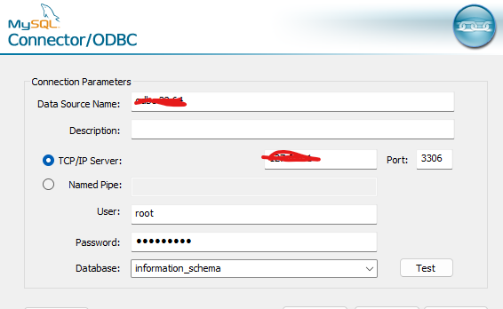
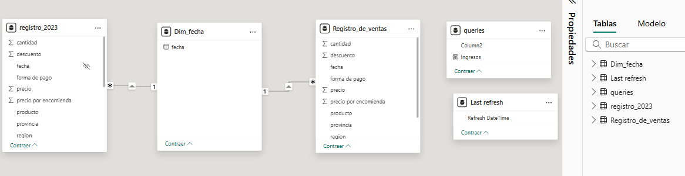
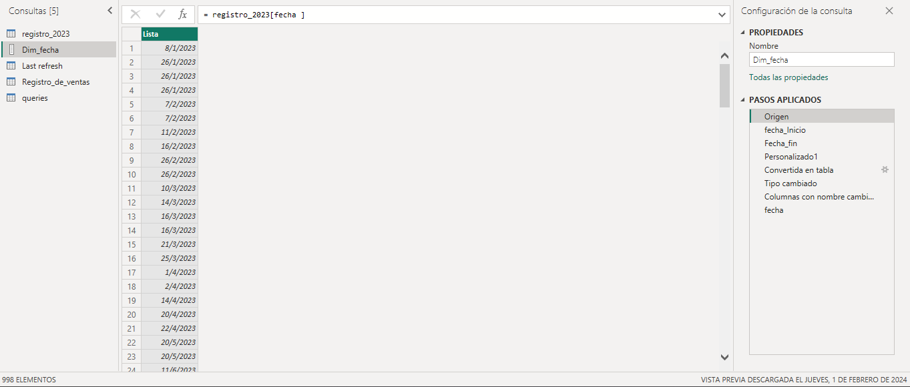
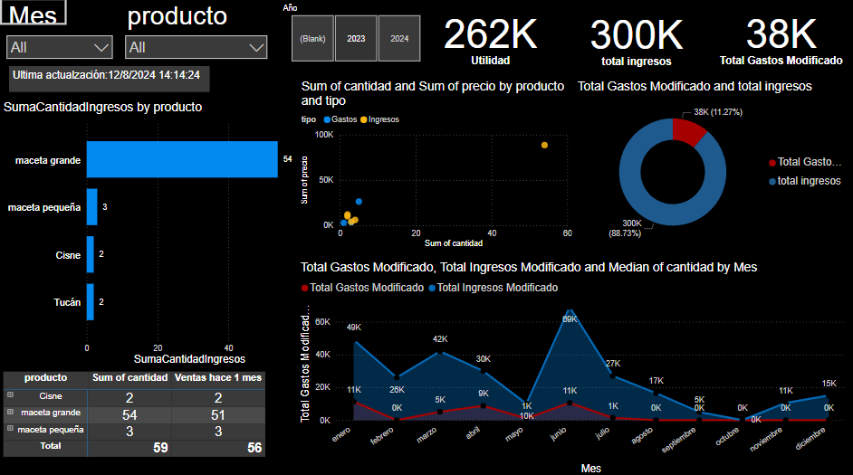
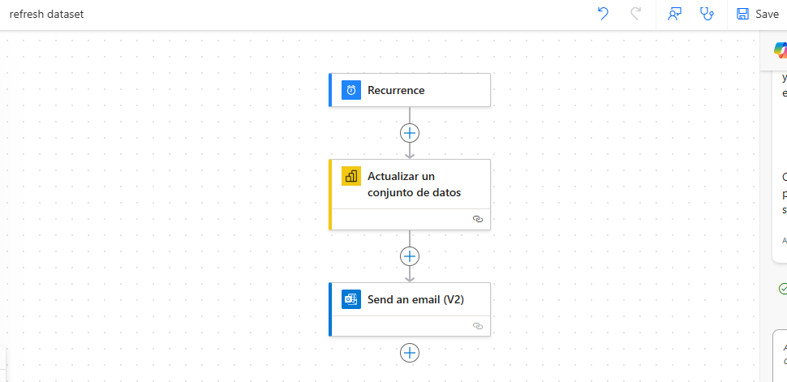

# Proyecto de Dashboard de Ventas y Control de Finanzas para Tienda

Este proyecto tiene como objetivo desarrollar un dashboard en Power BI para visualizar y analizar los datos de ventas y compras de una tienda. Además, este dashboard proporcionará un control financiero integral, permitiendo un análisis detallado para la toma de decisiones estratégicas.

## Estructura del Proyecto
El proyecto se basa en una hoja de cálculo de Excel con macros incorporadas, desde la cual se envían datos al servidor SQL. Posteriormente, Power BI se conecta al servidor SQL para extraer y visualizar los datos de forma dinámica. Esta estructura garantiza una gestión eficiente y centralizada de la información financiera de la tienda.

## Requisitos
- Power BI
- Excel con macros habilitadas
- Servidor SQL
- Power Automate

## Configuración
1. Habilitar macros en Excel.
2. Conectar la hoja de cálculo de Excel al servidor SQL utilizando VBA.
3. Importar datos al servidor SQL.

## Preparación de Ambiente para SQL
### Configuración de la ODBC
Configuramos nuestra base de datos y hacemos una conexión en nuestro panel de control con el Data Source ODBC.

## Preparación de Ambiente para Excel
Teniendo ya nuestra conexión lista con ODBC, podemos crear nuestras macros usando VBA. 

Para que todo se haga desde nuestro archivo de Excel, se crearán 2 macros, una para exportar datos y otra para obtener nuestros datos desde SQL.
### Macro para Exportar Datos a SQL
[Hacemos push de nuestra data de Excel hacia nuestro servidor SQL](Macros/ExportDataToExcel.vba)

### Macro para Obtener Datos desde SQL
[Hacemos pull de datos hacia Excel](Macros/GetDataFromODBC.vba)

## Implementación del Dashboard
1. Conectar Power BI al servidor SQL ODBC.
2. Importar datos de ventas y compras desde el servidor SQL a Power BI.
3. Crear visualizaciones y gráficos en Power BI para el análisis de los datos.

## Manejo de Base de Datos

En esta sección se muestran las relaciones entre tablas. Dentro de los datos se encuentran registros de ventas por año. Se crea una nueva tabla calendario para ingresar fechas faltantes, evitando futuros fallos, y además se añaden tarjetas para mostrar las actualizaciones que se realizarán con un flujo de trabajo próximamente.

La creación de una nueva tabla calendario se da de la siguiente manera:

### ETL y Manejo de Errores con Tabla Fecha

1. Extracción de la primera fecha de nuestros datos.
2. Extracción de las últimas fechas de nuestros registros de ventas.
3. Creación de un rango de fechas.
4. Convertir a tabla esos datos para tener el rango total de fechas.

Esto ayuda a no tener espacios faltantes en caso de que se realicen medidas en nuestro dashboard.

## Uso del Dashboard

- Interactuar con las visualizaciones para obtener insights sobre ventas, compras y finanzas de la tienda.
- Utilizar filtros y segmentaciones para un análisis detallado.

## Diseño de Flujo de Trabajo con Power Automate

Este flujo de trabajo en Power Automate conecta el dataset de nuestros datos en la nube y, con una recurrencia mensual, actualiza los datos del reporte si hay nuevos datos disponibles. Además, envía un correo electrónico a la persona encargada de administrar el dataset.

### Pasos del Flujo de Trabajo
1. **Conexión del Dataset:** El flujo se conecta al dataset alojado en la nube.
2. **Actualización del Dataset:** Una vez al mes, se verifica si hay nuevos datos disponibles y se actualiza el dataset en el reporte.
3. **Notificación por Correo Electrónico:** Se envía una notificación por correo electrónico a la persona encargada de la administración del dataset, informando sobre la actualización.

### Beneficios del Flujo de Trabajo
- **Automatización:** Reduce la necesidad de intervención manual al actualizar los datos.
- **Consistencia:** Asegura que el dataset esté siempre actualizado con la información más reciente.
- **Notificaciones:** Mantiene a los administradores informados sobre el estado del dataset y las actualizaciones.

Este flujo de trabajo mejora la eficiencia y la precisión del manejo de datos en tu proyecto.
