# Human Resources Dashboard Project

This project aims to develop an interactive and user-friendly **dashboard** for human resources management. The **dashboard** will provide a comprehensive view of employee data, evaluations, and salaries, allowing administrators to make informed decisions and improve personnel management.

## Project Structure

The project is organized as follows:

- **data/**: Contains the CSV files with the data needed for the **dashboard**.
  - `Tabla Empleados.csv`: Employee information, including their unique identifiers (Employee ID).
  - `Tabla Evaluacion.csv`: Performance evaluations of employees.
  - `Tabla Sueldo.csv`: Information about employee salaries.
- **imgs/**: Contains the images used in the **dashboard**.
  - `relacion_de_tablas.png`: Diagram of the relationship between the tables.

## Table Relationship

The tables are related through the `Employee ID` field, which acts as a primary key in the `Employees Table` and as a foreign key in the `Evaluation` and `Salary` tables.

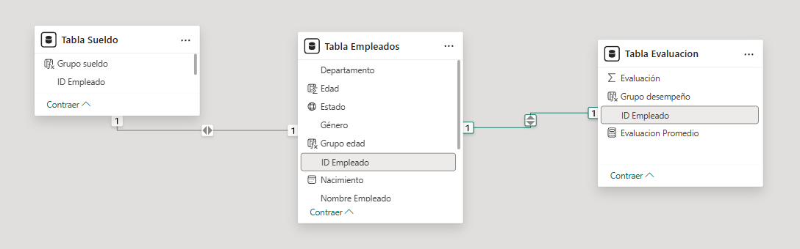

## Total Employees Sheet Visualization

For this sheet, we will have indicators, cards, stacked bar charts, map, stacked column charts, and tables that display the different data of our employees.

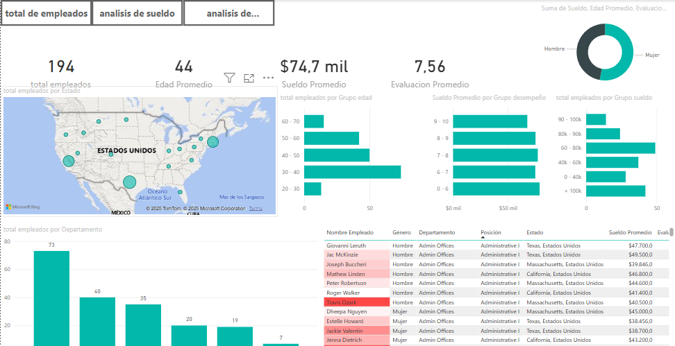

## Stacked Bar Chart Structure

In the chart on the left, we analyze age groups with the total of employees using the DAX measure `Grupo_Edad.dax`. In the center chart, we analyze the average salary by salary group and total of employees using the DAX measures `Sueldo_promedio.dax` and `Total_empleados.dax`.

### DAX Measures Used

- `Edad.dax`: Calculates the age of employees.
- `Edad_promedio.dax`: Calculates the average age of employees.
- `Evaluación_promedio.dax`: Calculates the average evaluation of employees.
- `Grupo_desempeño.dax`: Groups employees by performance.
- `Grupo_Edad.dax`: Groups employees by age range.
- `Sueldo_promedio.dax`: Calculates the average salary of employees.
- `Total_empleados.dax`: Calculates the total number of employees.

Each of these measures is used to provide more accurate and useful data in the dashboard charts and tables.

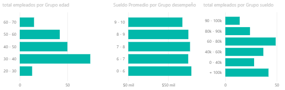

## Stacked Bar Chart Structure
This chart shows the number of employees we have and the department group they belong to using `Total_empleados.dax` and `Department` as axes.

### DAX Measures Used
- `Total_empleados.dax`: Calculates the total number of employees.

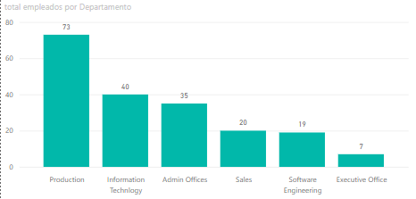

## Map Chart Structure
Within the map, we use the state where each employee works as the location, and the bubble size would be the total employees in that area.

### DAX Measures Used
- `Total_empleados.dax`: Calculates the total number of employees.

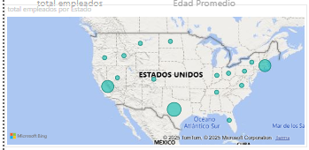

## Matrix Chart Structure

The following items were used as columns:

- `Employee name`
- `Gender`
- `Department`
- `Position`
- `State`
- `Average salary`
- `Evaluation`

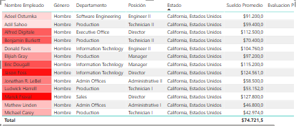

## Total Employees Sheet Visualization

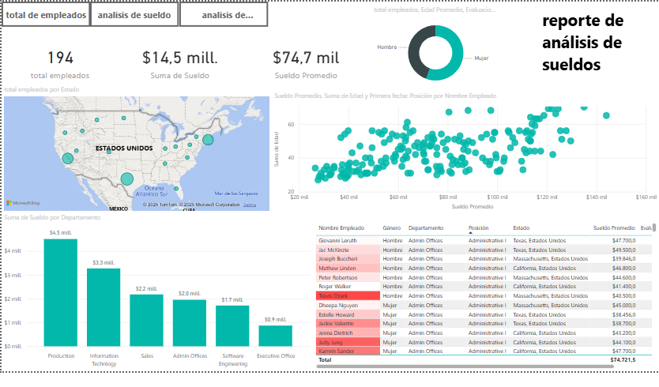

Here we maintain the structure of the previous sheet of total employees but in salary analysis we have something different which would be the scatter plot.

For this we use the age of each employee with their average salary

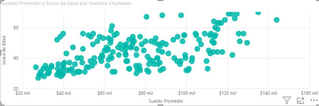

## Performance Analysis Sheet Visualization

1. **U.S. Map**: Shows the average evaluation and total employees by state.

2. **Bar Chart**: Shows the total employees by department.

3. **Additional Bar Chart**: Presents the average evaluation by manager name.

4. **Gender Bar Chart**: Details the total employees, average age, and average salary by gender.

5. **Employee Details Table**: Lists names, gender, department, position, state, and average salary of employees.

For this visualization we have the performance analysis that helps us see the evaluation of managers in each of the departments.

### Performance Chart Structure

In the stacked rows chart we have the name of each department manager and their average evaluation, with this we can see the performance of their employees and how they influence their teams, and in the stacked columns chart we have a gender segmentation and their average salary as well.

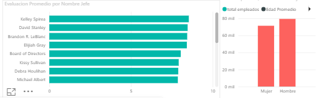

## Filter Application
We apply a configuration to our matrix in the employee name

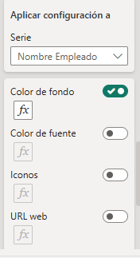

After that we make the corresponding function

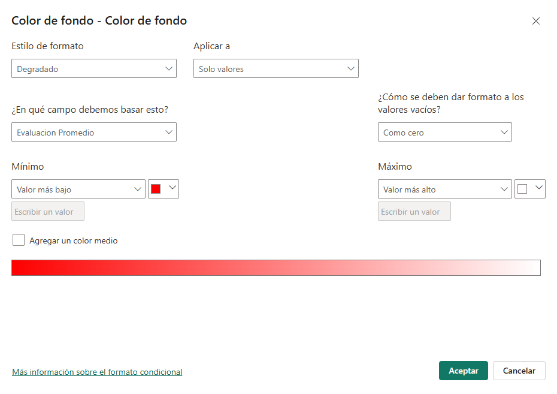

