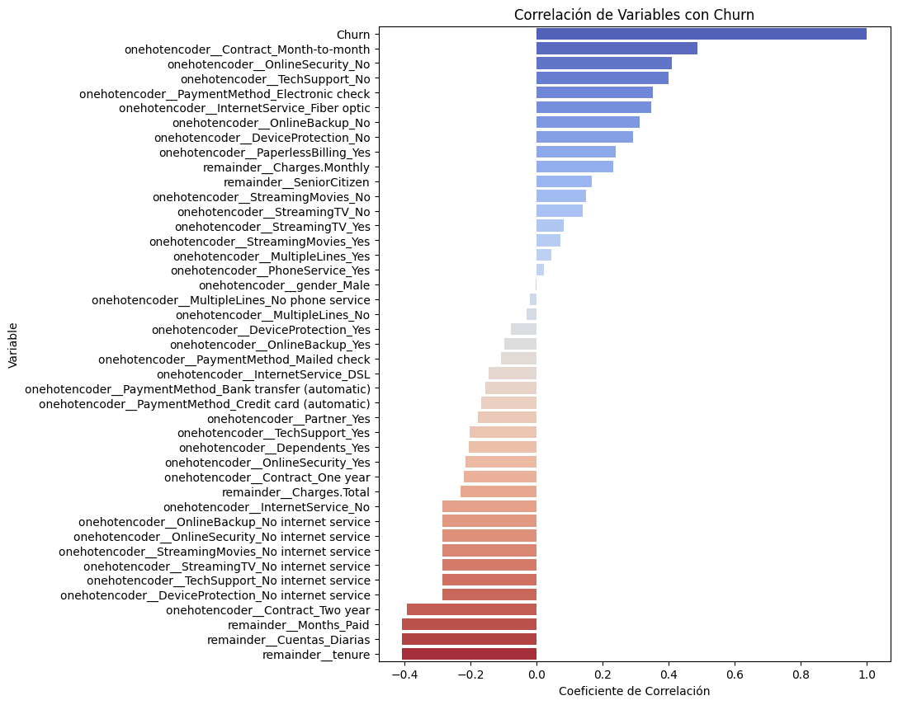

# Predictive Strategy for Customer Retention - Telecom X

## 1. Introduction and Project Mission
The main mission of this project is to develop **Machine Learning** models capable of predicting which customers are more likely to cancel their services at company **Telecom X**. The objective is to anticipate churn through a robust modeling pipeline that allows the company to take preventive actions based on data.

## 2. Challenge Objectives
* **Implement Churn as the central metric:** Define whether a customer has abandoned the loyalty program or not.
* **Data Preparation:** Perform treatment, encoding (OneHotEncoding), and normalization of variables.
* **Analysis and Selection:** Identify critical correlations between service variables and cancellation.
* **Modeling and Evaluation:** Train classification models and evaluate their performance using precision, recall, and accuracy metrics.

## 3. Data Description
The original dataset contains detailed information about contracted services, demographics, and billing for **7,032 customers**.

### Main Columns and Data Types:
* **Categorical Variables:** Include `PhoneService`, `MultipleLines`, `InternetService`, `OnlineSecurity`, `Contract`, `PaymentMethod`, among others.
* **Numeric Variables:** `tenure` (tenure), `Charges.Monthly` (monthly charges), `Charges.Total` (total charges), and `Months_Paid`.
* **Target Variable:** `Churn` (Binary: Yes/No), indicating customer churn.

## 4. Exploratory Data Analysis (EDA)
During exploration, it was identified that the dataset had an initial imbalance: **73.4%** active customers versus **26.6%** who cancelled. To correct this and improve training, the **SMOTE** technique was applied, achieving a balanced 50/50 distribution.

*Visualization of variables with the highest positive and negative impact on cancellation.*

### Key Findings:
* **Monthly Contracts:** Customers with "Month-to-month" contracts have a significantly higher tendency to churn.
* **Total Charges:** There is a clear relationship between tenure time and total accumulated spending as a retention factor.

*Analysis of total charges segmented by contract type.*

*Scatter plot of payments over time according to Churn status.*

## 5. Model Creation and Evaluation
Two algorithms with different approaches were implemented:
1.  **Decision Tree:** Valued for its high explainability and speed, operating through logical decision rules.
2.  **KNN (K-Nearest Neighbors):** Based on distance and similarity between records, requiring prior normalization of the data.

*Logical structure of decisions made by the tree algorithm.*

### Metrics Comparison:

| Metric | Decision Tree | KNN Model |
| :--- | :--- | :--- |
| **Accuracy** | **0.8096** | 0.7760 |
| **Precision** | **0.8131** | 0.7184 |
| **Recall (Sensitivity)** | 0.7894 | **0.8864** |

### Confusion Matrices:
These matrices allow visualizing the hits and errors (false positives/negatives) of each model:

## 6. Conclusion: Which model won?

Although the **Decision Tree** presents higher **Accuracy (80.96%)** and **Precision (81.31%)**, the **winner model for Telecom X's objectives is KNN**.

### Why KNN?
* **Higher Recall (88.64%):** In a customer churn problem, the cost of "losing" a customer who was actually going to leave (False Negative) is much higher than contacting a customer who might not have left.
* **Detection Capability:** The KNN model demonstrated a superior ability to correctly identify customers at risk of cancellation, fulfilling the mission of anticipating the problem more effectively.
* **Critical Variables:** The nearest neighbors analysis confirmed that factors such as `Dependents`, `PaperlessBilling`, and `Contract` are highly discriminative for determining similarity between customers who churn.