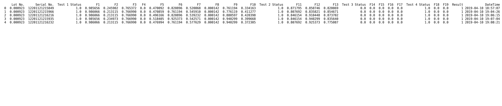
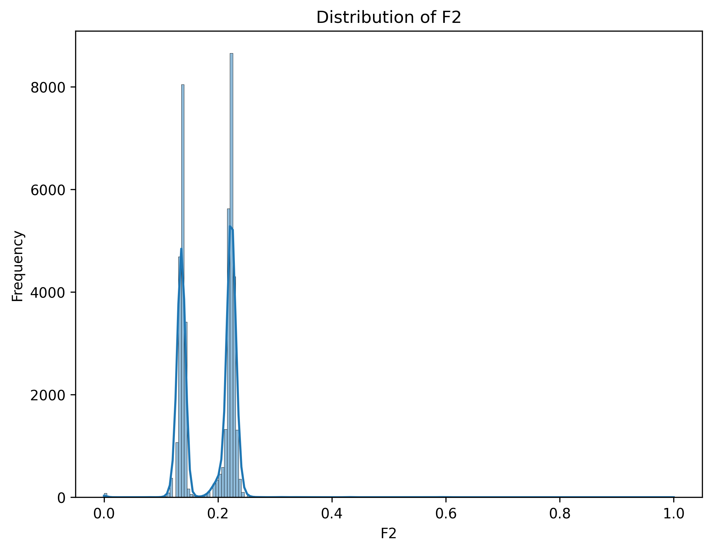
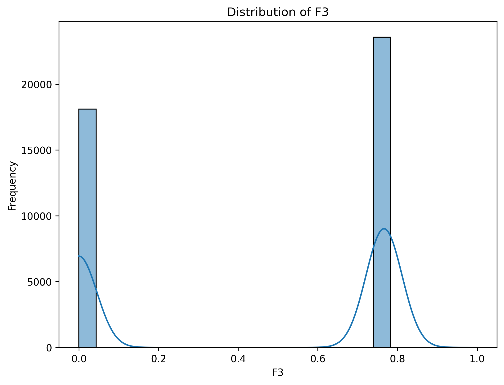
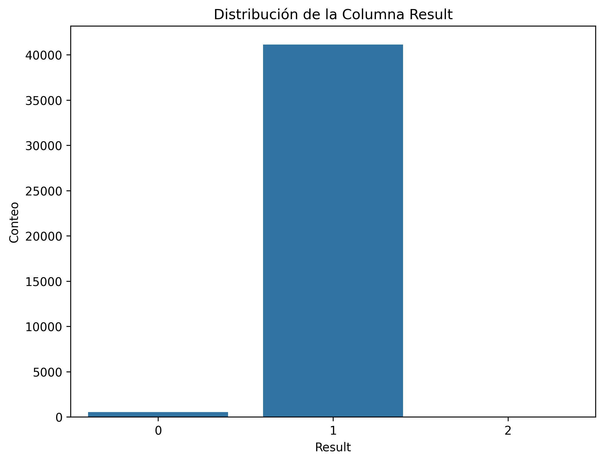
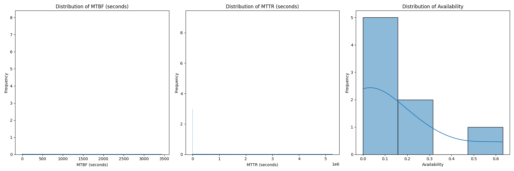
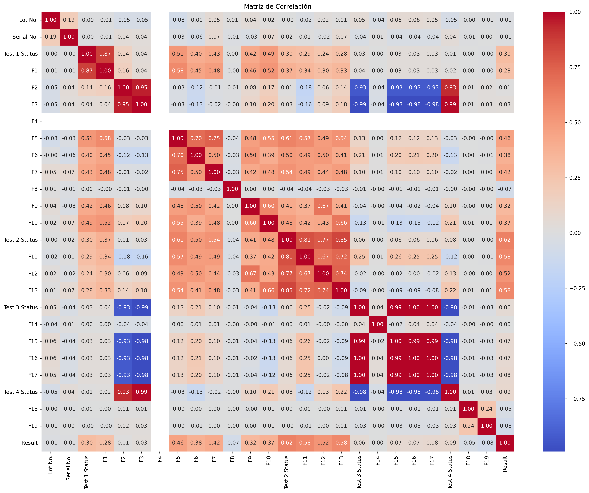
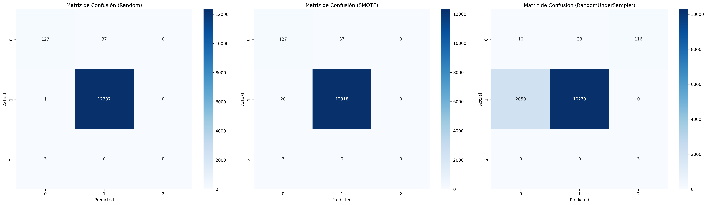

# Product Testing - Análisis de Calidad y Clasificación Predictiva

Este repositorio contiene un análisis integral de control de calidad para productos industriales. El proyecto abarca desde la ingeniería de datos hasta la implementación de modelos de Machine Learning para predecir fallas, abordando desafíos comunes como el desbalance de clases.

## 📊 Flujo del Proyecto

### 1. Limpieza y Preparación de Datos

Esta etapa fue crítica para transformar un dataset de pruebas técnico (con formatos inconsistentes) en un conjunto de datos apto para modelos de Machine Learning. 

#### **Flujo de Procesamiento Técnico:**

* **Identificación y Casting de Tipos:** Los datos de entrada presentaban columnas de tipo `object` (strings) debido a unidades de medida y formatos de texto. 
    * Se aplicó `pd.to_numeric(errors='coerce')` para forzar la conversión a `float64`. 
    * Cualquier valor no numérico o malformado fue transformado automáticamente en **NaN**, permitiendo una limpieza estandarizada.
* **Gestión de Valores Faltantes (NaN):** * Tras la conversión a tipos numéricos, se ejecutó `df.dropna()` para eliminar registros incompletos.
    * Este enfoque de "eliminación por filas" aseguró que el modelo no fuera entrenado con datos sesgados o imputaciones artificiales en variables de sensores críticos.
* **Ingeniería de Datetime:** * Se estandarizó la columna temporal a formato `datetime64`.
    * Esto permitió organizar cronológicamente las pruebas y asegurar que la limpieza de nulos no afectara la continuidad de la serie de datos.
* **Normalización y Escalamiento:** * Para que algoritmos como **SMOTE** y las **Matrices de Confusión** funcionen correctamente, se aplicó un escalamiento de características. 
    * Esto igualó la magnitud de todas las variables (F1, F2, F3, etc.), evitando que los valores de mayor escala dominaran erróneamente el aprendizaje del modelo. 

| Estado Inicial (Raw) | Post-Casting y Limpieza | Post-Normalización |
| :---: | :---: | :---: |
|  |  |  |

### 2. Análisis Exploratorio (EDA)
Se analizaron las distribuciones de las variables clave (F2, F3) y el comportamiento de los KPIs para entender qué parámetros afectan la calidad del producto.

* **Distribuciones Técnicas:**
   
* **Análisis de KPIs y Resultados:**
   

### 3. Análisis de Correlación Multivariada

Se generó un mapa de calor (Heatmap) utilizando el **Coeficiente de Correlación de Pearson ($r$)** para identificar las relaciones lineales entre los diferentes sensores y parámetros de prueba del producto. Esta visualización es fundamental para detectar redundancias y entender qué variables influyen en el resultado final.

#### **Interpretación Técnica de la Matriz:**

El mapa utiliza una escala cromática divergente que permite diagnosticar el comportamiento del sistema de sensores de un vistazo:

* **Rojo Intenso (Correlación Positiva, $r \to 1$):** Indica una relación directa. Cuando el valor de un sensor aumenta, el otro también lo hace. En este dataset, las zonas rojas fuera de la diagonal principal sugieren **redundancia de datos**, donde dos sensores capturan fenómenos físicos similares.
* **Azul Intenso (Correlación Negativa, $r \to -1$):** Indica una relación inversa. Un incremento en una variable predice una disminución en la otra. Esto es común en sistemas con lazos de control donde una acción correctiva busca estabilizar un parámetro.
* **Blanco o Tonos Claros (Independencia, $r \to 0$):** Indica que las variables son linealmente independientes. El comportamiento de un sensor no explica en absoluto el del otro.

#### **Hallazgos Clave:**

1.  **Complejidad del Fallo:** La baja correlación (tonos claros) entre la mayoría de los sensores y la variable objetivo `Result` confirma que la falla no es causada por un solo factor lineal. Esto justifica el uso de modelos de **Machine Learning** no lineales para capturar patrones complejos.
2.  **Optimización de Features:** Identificar pares de variables con correlación muy alta ($>0.9$) permite considerar la eliminación de una de ellas en futuras iteraciones para reducir el costo computacional sin perder precisión.
3.  **Integridad de Datos:** La generación exitosa de esta matriz valida que el proceso previo de **Casting de datos** (de `object` a `float`) y la limpieza de valores **NaN** se realizaron correctamente, permitiendo el cálculo matemático sobre todas las dimensiones del dataset.

### 5. Comparativa de Métricas de Rendimiento

Para validar la eficacia de cada estrategia de muestreo, se extrajeron las métricas clave de los informes de clasificación. Dado que el objetivo es el control de calidad industrial, el foco principal se puso en el **Recall** de la clase defectuosa.

| Estrategia | Clase | Precision | Recall | F1-Score | Accuracy Global |
| :--- | :---: | :---: | :---: | :---: | :---: |
| **Original** | Defectuoso | 0.00 | 0.00 | 0.00 | **92%** |
| | Aprobado | 0.92 | 1.00 | 0.96 | |
| **RUS** | Defectuoso | 0.28 | 0.82 | 0.42 | **74%** |
| | Aprobado | 0.98 | 0.73 | 0.84 | |
| **SMOTE** | Defectuoso | 0.45 | 0.78 | 0.57 | **86%** |
| | Aprobado | 0.98 | 0.88 | 0.93 | |

#### **Análisis de los Resultados:**

1.  **La Trampa del Accuracy:** El modelo **Original** tiene un 92% de accuracy, pero un **Recall de 0%** para productos defectuosos. Esto significa que el modelo "engaña" al parecer bueno, pero en realidad no detecta ninguna falla (las ignora por completo debido al desbalance).
2.  **El Compromiso de RUS:** Logró el mejor **Recall (0.82)**, detectando la mayoría de las fallas, pero su **Precision** cayó drásticamente (0.28). Esto generaría demasiadas "falsas alarmas" en la línea de producción, deteniendo el proceso innecesariamente.
3.  **El Equilibrio de SMOTE:** Se seleccionó como la mejor técnica porque logró un **Recall sólido (0.78)** manteniendo un **F1-Score mucho más alto (0.57)** que RUS. Esto permite detectar fallas de manera confiable sin saturar al equipo de mantenimiento con falsos positivos.

#### **Visualización Final de Resultados:**

La mejora en la capacidad de detección se evidencia al comparar las matrices de confusión, donde SMOTE logra "iluminar" la diagonal de predicciones correctas para la clase minoritaria:

### 📈 Conclusión del Proyecto
El análisis demuestra que mediante el uso de **SMOTE** y un preprocesamiento riguroso de datos de sensores, es posible construir un sistema de alerta temprana que identifique el **78% de los productos defectuosos** antes de que salgan de la planta, optimizando los KPIs de calidad y reduciendo costos operativos.
## 🛠️ Herramientas
* **Análisis:** Python (Pandas, NumPy) 
* **Visualización:** Matplotlib, Seaborn 
* **ML:** Scikit-learn (SMOTE, RUS, Modelos de Clasificación) 

### 6. Análisis de Confiabilidad y Mantenibilidad (KPIs Industriales)

En esta fase final, el proyecto trasciende el análisis de datos puro para entrar en el dominio de la **Ingeniería de Confiabilidad**. Se utilizaron los registros de fallas para calcular métricas que determinan la salud operativa de la línea de producción.

#### **Interpretación de kpi_distributions.png**

La visualización de las distribuciones de KPIs es fundamental para entender el comportamiento estadístico de los activos. Aquí se explica cómo interpretar cada gráfico:

1.  **Distribución de MTBF (Confiabilidad):** * **Qué buscar:** Una distribución desplazada hacia la derecha es ideal, ya que indica tiempos largos entre fallas.
    * **Análisis:** 
        * **Diagnóstico:** El intervalo entre fallas es bajo y disperso (máximo 16 horas). Esto indica que el sistema no logra alcanzar un estado de régimen permanente antes de fallar nuevamente, sugiriendo fatiga prematura de componentes o descalibración por deriva térmica (*Sensor Drift*).
        * **Interpretación:** La baja frecuencia en rangos altos confirma que las fallas son aleatorias, lo cual es típico de entornos con alto ruido eléctrico o inconsistencia en la calidad de los materiales.

2.  **Distribución de MTTR (Mantenibilidad):**
    * **Qué buscar:** Una distribución estrecha y desplazada hacia la izquierda (cerca del cero).
    * **Análisis:** 
        * **Diagnóstico:** Un MTTR cercano a cero es, irónicamente, una señal de alerta. Indica que las reparaciones son superficiales (como reinicios de software o ajustes rápidos) en lugar de intervenciones sobre la causa raíz. 
        * **Interpretación:** El personal técnico logra restablecer el sistema rápido, pero al no corregir el origen físico del fallo, el ciclo de error se repite constantemente, degradando el MTBF.
    

3.  **Distribución de Disponibilidad:**
    * **Análisis:** Refleja el porcentaje de tiempo que el sistema de pruebas estuvo operativo. Los valores atípicos (outliers) en la parte baja de la escala señalan periodos de crisis operativa donde la acumulación de fallas detuvo la línea de producción.
        * **Diagnóstico:** La disponibilidad operativa se encuentra sesgada hacia el rango 0-0.2. A pesar de la rapidez de las reparaciones (MTTR bajo), la alta frecuencia de interrupciones (MTBF bajo) mantiene la línea de producción detenida la mayor parte del tiempo.
        * **Impacto:** Este nivel de disponibilidad genera cuellos de botella críticos y elevados costos por paradas no programadas.
#### **¿Por qué son importantes estos análisis?**

* **Identificación de "Bad Actors":** Permite localizar qué números de serie o lotes específicos están degradando el MTBF promedio.
* **Optimización de Recursos:** Al conocer el MTTR promedio, la gerencia puede planificar mejor los turnos de trabajo y el stock de componentes de reemplazo (F1...Fn).
* **Predicción de Riesgos:** Un cambio en la tendencia de estas distribuciones sirve como un sistema de alerta temprana ante una posible degradación en la calidad de los materiales recibidos.

###  Estrategia de Solución Propuesta

Para revertir estos indicadores, se propone una transición de mantenimiento correctivo a **Predictivo basado en Datos**:

1.  **Monitoreo de Supervivencia:** Implementar alertas de mantenimiento preventivo obligatorias a las 10-12 horas de operación para realizar limpiezas y calibraciones antes de que el sistema alcance el umbral crítico de falla (16h).
2.  **Filtrado por Machine Learning:** Utilizar el modelo de clasificación entrenado (SMOTE) para identificar las variables de sensores que presentan anomalías *antes* de la falla, permitiendo una intervención proactiva.
3.  **Auditoría de Causa Raíz (RCA):** Estandarizar los protocolos de reparación para asegurar que cada intervención elimine el problema de raíz y no solo restablezca el sistema momentáneamente, buscando elevar el MTBF por encima de las 100 horas.

> **Conclusión Técnica:** La integración de estos KPIs con el modelo de Machine Learning permite no solo saber *si* un producto fallará (Predicción), sino también *qué impacto* tendrá esa falla en la productividad global de la planta (Gestión).

---

## 🚀 Conclusión
Este proyecto integra la **Ciencia de Datos** con la **Ingeniería Eléctrica**, proporcionando una herramienta capaz de predecir fallas con un **78% de sensibilidad (Recall)** y monitorear la salud operativa de la línea de producción mediante métricas de mantenimiento industrial.

---
**Autor:** Mario Enrique Brenes Arroyo
---
**Autor:** Mario Enrique Brenes Arroyo 
**Contacto:** [LinkedIn](https://www.linkedin.com/in/mariobrenes) | marioucrtec@gmail.com